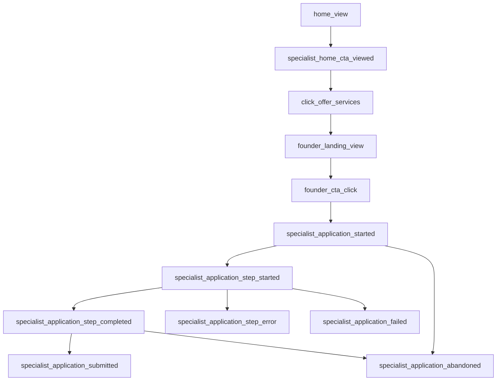

# Conversion funnel specialists

Este playbook traduce los eventos de analytics en decisiones de crecimiento para captar especialistas fundadores reales.

## Funnel principal

## Vista admin

La ruta `/admin/crm/acquisition` muestra:

- visitas 24h
- visitas 7 dias
- clicks "Ofrecer mis servicios"
- visitas landing fundadores
- inicios de registro
- errores de registro por paso
- fallos de envio
- registros enviados
- tasa landing a inicio
- tasa inicio a envio
- paginas mas vistas
- campanas UTM
- abandono por paso
- solicitudes "no encuentro mi oficio"
- postulantes que necesitan ayuda de formalizacion tributaria
- eventos recientes
- postulaciones captadas en D1

## Interpretacion

| Sintoma | Lectura | Accion |
| --- | --- | --- |
| Visitas altas y clicks bajos | La propuesta no esta clara o el CTA no se ve | Ajustar hero, texto del CTA y prueba de confianza |
| Clicks altos y landing views bajos | Link, navegacion o carga puede fallar | Revisar href, deploy y mobile |
| Landing views altas y CTA clicks bajos | Landing no convence rapido | Repetir CTA, reducir texto, mostrar beneficio concreto |
| Starts altos y submits bajos | Registro tiene friccion | Revisar paso con mas abandono y microcopy |
| Errores de paso concentrados | Un requisito o texto bloquea conversion | Revisar `reason` y ajustar copy, orden o validacion |
| Muchas solicitudes de oficio no listado | El catalogo no cubre demanda real | Priorizar nueva especialidad o landing SEO |
| Mucha ayuda de formalizacion | Hay barrera tributaria | Preparar guia y soporte operativo antes de aprobar |
| Submits altos y pocos aprobados | Operacion posterior lenta | Revisar CRM, tareas y SLA |

## Pasos del registro

El registro especialista reporta:

- `specialist_application_started`
- `specialist_application_step_started`
- `specialist_application_step_completed`
- `specialist_application_step_error`
- `specialist_application_failed`
- `specialist_application_abandoned`
- `specialist_application_submitted`
- `specialist_custom_trade_requested`
- `specialist_formalization_help_requested`

El evento de abandono guarda el mayor paso alcanzado y el nombre del paso, sin guardar RUT, documentos ni datos sensibles. Los eventos de error guardan solo el motivo operacional, paso, oficio, comuna y contexto de UTM.

## Metricas minimas semanales

1. Click rate Home a CTA especialista: `click_offer_services / home_view`.
2. Landing conversion: `founder_cta_click / founder_landing_view`.
3. Start rate: `specialist_application_started / founder_landing_view`.
4. Submit rate: `specialist_application_submitted / specialist_application_started`.
5. Abandono por paso.
6. Errores por paso y motivo.
7. Oficios no encontrados.
8. Postulantes con ayuda de formalizacion.
9. Fuente con mejor submit rate.
10. Campana con mas registros enviados.

## Umbrales iniciales

Estos umbrales son para piloto, no para escala final:

- Home a CTA especialista: mayor a 1.5%.
- Landing a inicio: mayor a 8%.
- Inicio a envio: mayor a 25%.
- Abandono concentrado en un paso: revisar si supera 45% del abandono total.

## Kaizen semanal

1. Observar datos en `/admin/crm/acquisition`.
2. Diagnosticar el tramo con mayor perdida.
3. Priorizar un solo cambio de conversion.
4. Implementar sin rehacer la pagina.
5. Validar mobile, build y dry-run.
6. Desplegar.
7. Medir 7 dias.
8. Repetir.

## Pendientes recomendados

- Cuando se autorice tocar Worker, crear alias `POST /api/events` o tabla dedicada `analytics_events`.
- Agregar cohortes por oficio y comuna cuando el volumen supere 100 eventos semanales.
- Conectar eventos con Search Console para decidir nuevas paginas SEO sin spam.
